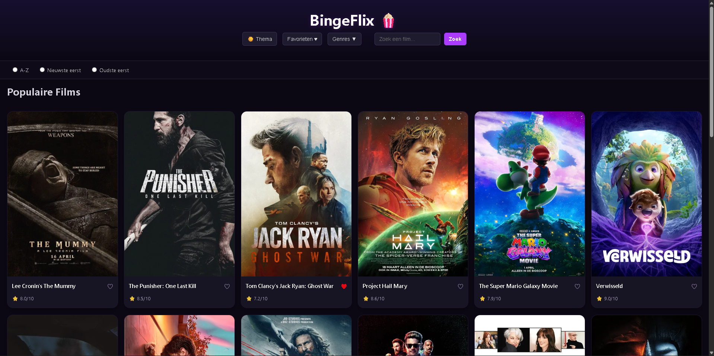
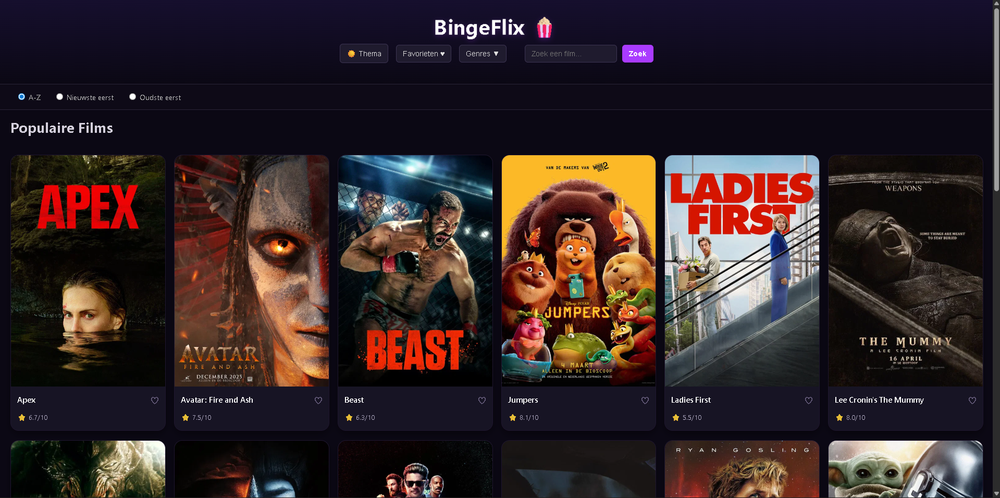
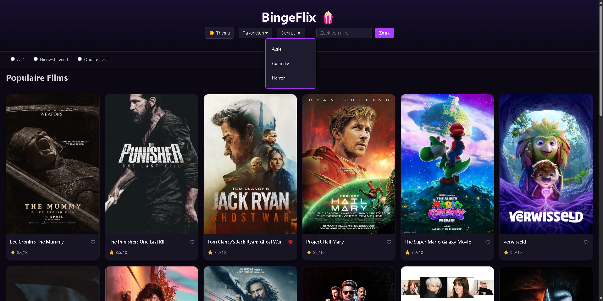
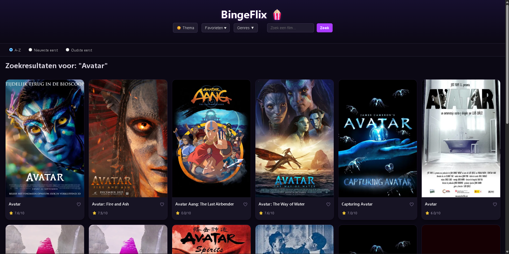
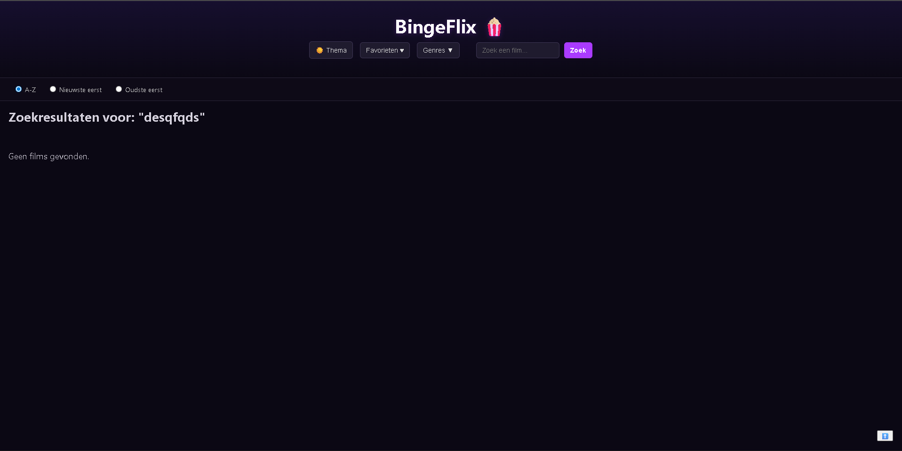
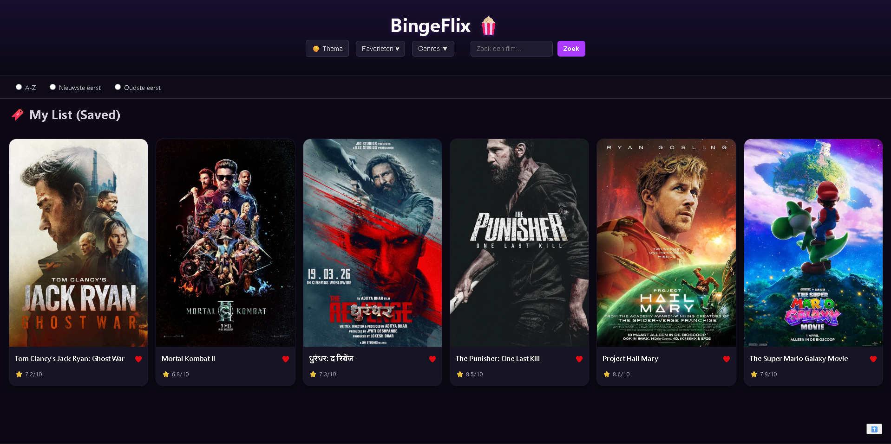
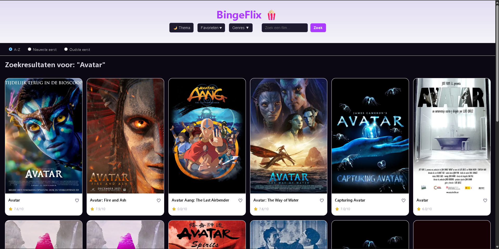

# 🍿 BingeFlix

Een filmwebapplicatie als schoolproject waarmee je populaire films kunt ontdekken, zoeken, filteren op genre, sorteren en opslaan in je favorieten.

---

## 📋 Projectbeschrijving

BingeFlix is een single-page webapplicatie gebouwd met **Vanilla JavaScript (ES Modules)**, **HTML5** en **CSS3**. De app haalt live filmdata op via de TMDB API en biedt een gebruiksvriendelijke interface om films te ontdekken en bij te houden.

### ✅ Functionaliteiten

- 🔍 **Zoeken** naar films via een zoekbalk
- 🎬 **Populaire films** tonen bij opstarten
- 🎭 **Filteren op genre** (Actie, Comedie, Horror) via een dropdown
- 🔃 **Sorteren** op titel (A-Z), nieuwste of oudste eerst
- ❤️ **Favorieten opslaan** en beheren via localStorage
- 🌙 **Lichte/donkere modus** wisselen
- ⬆️ **Terug naar boven** knop bij scrollen
- 🖼️ **Film samenvatting** zichtbaar bij hover over een kaart
- ⚠️ **Melding** wanneer er geen films gevonden worden

---

## 🌐 Gebruikte API's

**The Movie Database (TMDB)**  
Link: [https://developer.themoviedb.org/reference/intro/getting-started](https://developer.themoviedb.org/reference/intro/getting-started)

> Mijn persoonlijke API key is niet meegedeeld in de code.

### Gebruikte TMDB endpoints

| Endpoint | Beschrijving |
|----------|-------------|
| `/movie/popular` | Populaire films ophalen |
| `/search/movie?query=...&language=nl-NL&page=1` | Films zoeken op trefwoord |
| `/discover/movie?with_genres=...&language=nl-NL&page=1` | Films filteren op genre-ID |
| `https://image.tmdb.org/t/p/w500{poster_path}` | Filmposters weergeven |

---

## ⚙️ Implementatie Technische Vereisten

### DOM Manipulatie
| Vereiste | Implementatie | Bestand | Regelnummer |
|----------|--------------|---------|-------------|
| Elementen selecteren | `document.querySelector(".films")` | `ui.js` | regel 5 |
| Elementen manipuleren | `filmContainer.innerHTML` / `appendChild()` | `ui.js` | regel 7 & 56 |
| Events aan elementen koppelen | `saveBtn.addEventListener('click', ...)` | `ui.js` | regel 46 |

---

### Modern JavaScript
| Vereiste | Implementatie | Bestand | Regelnummer |
|----------|--------------|---------|-------------|
| Gebruik van constanten | `const apiKey = "..."` | `api.js` | regel 2 |
| Template literals | `` filmCard.innerHTML = `...${movie.title}...` `` | `ui.js` | regel 26 |
| Iteratie over arrays | `movies.forEach(function(movie) {...})` | `ui.js` | regel 15 |
| Array methodes | `Favorites.some(...)` / `Favorites.filter(...)` | `storage.js` | regel 14 & 18 |
| Arrow functions | `sortedFilms.sort((a, b) => ...)` | `main.js` | regel 22 |
| Ternary operator | `isAlreadySaved ? '♥' : '♡'` | `ui.js` | regel 32 |
| Callback functions | `sortRadios.forEach(function(radio) {...})` | `main.js` | regel 88 |
| Async & Await | `async function fetchPopularFilms()` | `api.js` | regel 6 |
| Observer API | `new IntersectionObserver(function(entries) {...})` | `main.js` | regel 132 |

---

### Data & API
| Vereiste | Implementatie | Bestand | Regelnummer |
|----------|--------------|---------|-------------|
| Fetch om data op te halen | `fetch(baseUrl + '/movie/popular?...')` | `api.js` | regel 8 |
| JSON manipuleren en weergeven | `await response.json()` → filmkaarten renderen | `api.js` | regel 9 |

---

### Opslag & Validatie
| Vereiste | Implementatie | Bestand | Regelnummer |
|----------|--------------|---------|-------------|
| Formulier validatie | `if (term !== "")` — lege zoekterm wordt niet verwerkt | `main.js` | regel 44 |
| Gebruik van localStorage | `localStorage.getItem` / `localStorage.setItem` | `storage.js` | regel 5 & 24 |

---

### Styling & Layout
| Vereiste | Implementatie | Bestand | Regelnummer |
|----------|--------------|---------|-------------|
| Basis HTML layout | CSS Grid — `grid-template-columns: repeat(6, ...)` | `style.css` | `.films` klasse |
| Basis CSS | CSS variabelen, achtergrondkleuren, hover-animaties | `style.css` | `:root` & `.film-card` |
| Gebruiksvriendelijke elementen | Hartjes (♡/♥), thema-icoontje, terug-naar-boven knop | `ui.js` & `main.js` | `ui.js` regel 32, `main.js` regel 113 |

---

## 💻 Installatiehandleiding

### Vereisten
- [Node.js](https://nodejs.org/) (v18 of hoger)
- Een TMDB API key — gratis aan te maken op [https://www.themoviedb.org/settings/api](https://www.themoviedb.org/settings/api)

### Stappen

```bash
# 1. Clone de repository
git clone https://github.com/PhilippeAI2025/Bingeflix.git

# 2. Navigeer naar de projectmap
cd Bingeflix

# 3. Installeer de dependencies
npm install

# 4. Start de development server
npm run dev
```

Open de URL die in de terminal verschijnt: `http://localhost:5173`

### API Key instellen
Vervang in `src/js/api.js` de bestaande sleutel door jouw eigen TMDB API key:

```js
const apiKey = "JOUW_API_KEY_HIER";
```

---

## 📸 Screenshots

### Homepagina


### Filtermogelijkheden (A-Z, Nieuwste, Oudste)


### Filter op genre


### Zoekresultaten


### Geen films gevonden


### Favorieten


### Lichtmodus


---

## 📚 Bronnenlijst

- [TMDB API Documentatie](https://developer.themoviedb.org/docs)
- [MDN Web Docs — Fetch API](https://developer.mozilla.org/en-US/docs/Web/API/Fetch_API)
- [MDN Web Docs — localStorage](https://developer.mozilla.org/en-US/docs/Web/API/Window/localStorage)
- [MDN Web Docs — IntersectionObserver](https://developer.mozilla.org/en-US/docs/Web/API/Intersection_Observer_API)
- [CSS Grid — CSS Tricks](https://css-tricks.com/snippets/css/complete-guide-grid/)
- [JavaScript.info — Modern JavaScript](https://javascript.info/)
- [W3Schools – JavaScript](https://www.w3schools.com/js/default.asp)
- [W3Schools – HTML](https://www.w3schools.com/html/default.asp)
- [W3Schools – CSS](https://www.w3schools.com/css/default.asp)
- [YouTube Tutorial — Building a website with JS](https://www.youtube.com/watch?v=EerdGm-ehJQ)
- Voorkennis van backend development

### 🤖 AI Chatlog
Tijdens de ontwikkeling werd hulp gevraagd aan **Claude (Anthropic)** en **ChatGPT (OpenAI)**. De volgende zaken werden besproken:
- Debuggen van de zoekbalk (id mismatch tussen HTML en JS — `zoek-form` vs `search-form`)
- Oplossen van de home knop die niet werkte door een JS-fout        
- Oplossen van API Fetch error 
- oplossen van niet werkende knoppen 
- Structuur en opbouw van de README
- [Voorbeeld_van_Chatlog](./screenshots/Voorbeeld.png)

---

## 👤 Auteur

**Wilangi-Otongi-Philippe**  
[GitHub profiel](https://github.com/PhilippeAI2025/Bingeflix)  
Datum: 25 mei 2025